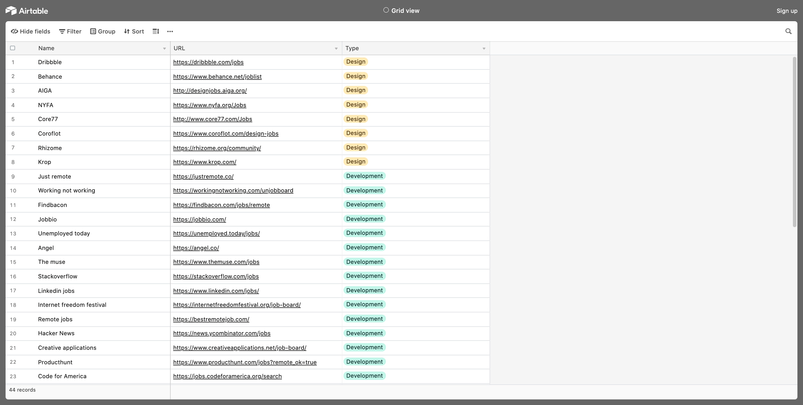
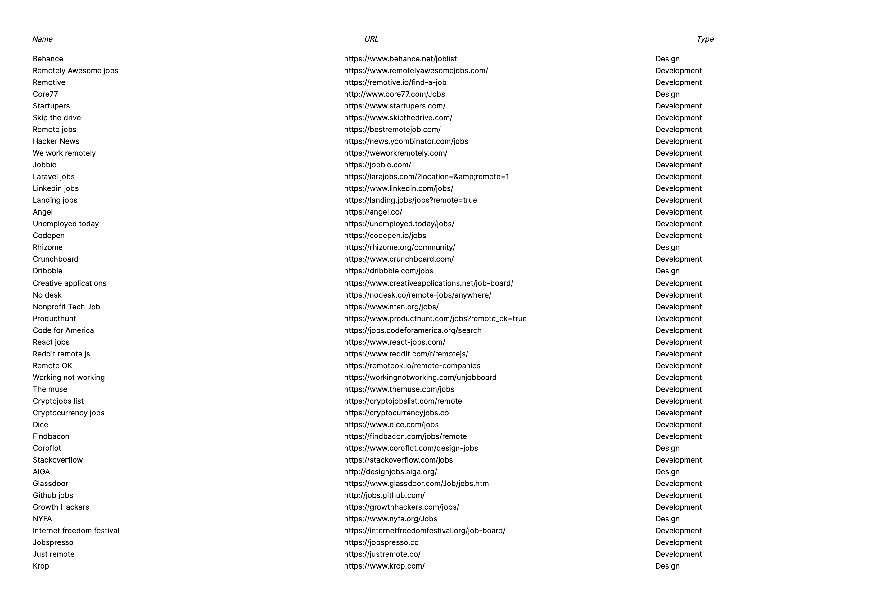

## Airtable as CMS

Boilerplate code for a very simple frontend that uses [Airtable](https://airtable.com/) as a CMS. Built using `create-react-app`. It simply fetches and displays the data along with the column headers.

### Airtable view


### Frontend view


## How to run locally

`yarn install` and `yarn start`


In order to authenticate to Airtable API, you have to create a `.env` file in the root directory, in which you will list the following parameters: 

```
REACT_APP_AIRTABLE_API_KEY=YOUR_AIRTABLE_KEY
REACT_APP_AIRTABLE_API_URL=https://api.airtable.com/v0
REACT_APP_AIRTABLE_BASE=YOUR_AIRTABLE_BASE_ID
REACT_APP_AIRTABLE_TABLE=YOUR_AIRTABLE_TAB_NAME
```

If you change the details above, you need to restart your server. 

Read more about the Airtable API [here](https://airtable.com/api).

## How to style
I have created some very simple layout and sizing classes in `App.css`. The table is built with flexbox, so it should respond quite well to responsive environments. 

[Link to App.css](https://github.com/Kallirroi/airtable_as_cms/blob/a74765ff50d81f57a625c2f8da03e81da854a2b4/src/App.css#L57)

## How to deploy
I am using [Vercel](https://vercel.com/) (ex-Zeit) or [Netlify](https://app.netlify.com/). Don't forget to set up the `env` variables (both services offer a way to do that on their platform GUI).